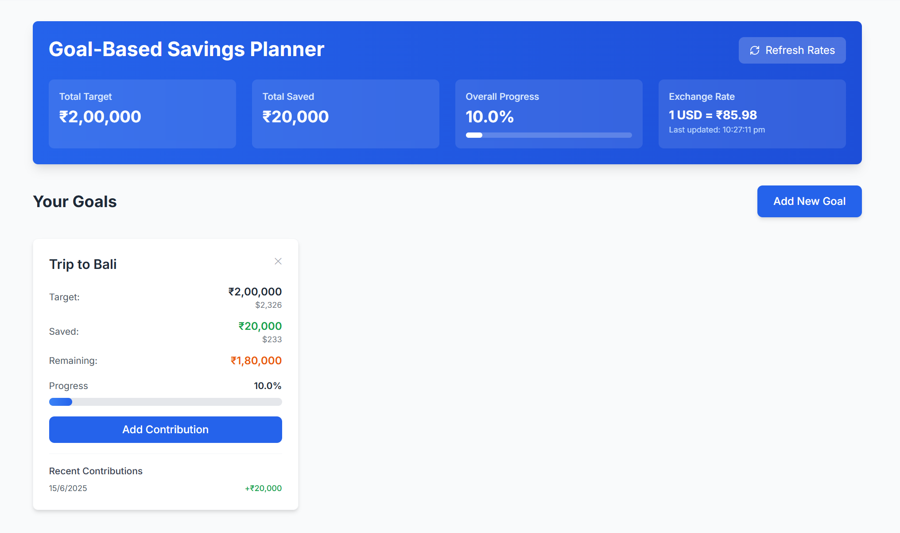

# Goal-Based Savings Planner

A modern, responsive web application for tracking and managing financial goals with real-time currency conversion between INR and USD.

## 🌍 Live Demo

👉 [goal-savings-planner.vercel.app](https://goal-savings-planner.vercel.app) (example)


## 📸 Demo




## 🚀 Tech Stack

- **React 18+** with TypeScript
- **Tailwind CSS** for styling
- **Exchange Rate API** for real-time currency conversion
- **Local Storage** for data persistence

## ✨ Features

- **Dashboard Overview**: Track total targets, savings, and overall progress
- **Goal Management**: Create, track, and delete multiple financial goals
- **Currency Support**: Full support for INR and USD with real-time conversion
- **Contribution Tracking**: Add contributions with date tracking
- **Responsive Design**: Mobile-first design that works on all devices
- **Data Persistence**: All data saved locally in browser storage
- **Real-time Exchange Rates**: Live USD to INR conversion rates

## 🎯 Core Functionality

### Goal Creation
- Add new savings goals with custom names
- Set target amounts in INR or USD
- Goals are displayed as interactive cards

### Progress Tracking
- Visual progress bars for each goal
- Percentage completion tracking
- Remaining amount calculations
- Currency conversion display

### Contribution Management
- Add contributions to any goal
- Date-based contribution tracking
- Recent contribution history
- Real-time progress updates

### Dashboard Analytics
- Total target across all goals (in INR)
- Total saved amount
- Overall progress percentage
- Live exchange rate display with refresh functionality

## 🛠️ Setup Instructions

1. **Clone the repository**
   ```bash
   git clone <repository-url>
   cd goal-based-savings-planner
   ```

2. **Install dependencies**
   ```bash
   npm install
   ```

3. **Start development server**
   ```bash
   npm run dev
   ```

4. **Build for production**
   ```bash
   npm run build
   ```

## 📱 Usage

1. **Create Your First Goal**: Click "Add New Goal" and fill in the details
2. **Track Progress**: View your goals on the dashboard with visual progress bars
3. **Add Contributions**: Click "Add Contribution" on any goal card to record savings
4. **Monitor Exchange Rates**: Use the refresh button to get latest USD to INR rates
5. **View Analytics**: Check your overall progress in the dashboard banner

## 🏗️ Project Structure

```
src/
├── components/          # React components
│   ├── Header.tsx      # Dashboard header with metrics
│   ├── GoalCard.tsx    # Individual goal card component
│   ├── AddGoalModal.tsx        # Modal for creating new goals
│   └── AddContributionModal.tsx # Modal for adding contributions
├── hooks/              # Custom React hooks
│   ├── useGoals.ts     # Goal management logic
│   └── useExchangeRate.ts # Exchange rate fetching
├── types/              # TypeScript type definitions
│   └── goal.ts         # Goal and Contribution interfaces
├── utils/              # Utility functions
│   └── currency.ts     # Currency formatting and conversion
└── pages/
    └── Index.tsx       # Main application page
```

## 🎨 Design Decisions

- **Mobile-First**: Responsive grid layout that adapts to screen sizes
- **Modern UI**: Clean cards with subtle shadows and gradients
- **Intuitive UX**: Clear visual hierarchy and action buttons
- **Real-time Feedback**: Immediate updates for all user actions
- **Professional Aesthetics**: Blue color scheme with proper contrast

## 🔄 Data Flow

1. Goals are managed through the `useGoals` hook with local storage persistence
2. Exchange rates are fetched via `useExchangeRate` hook with caching
3. All currency calculations happen in real-time
4. UI updates immediately reflect data changes

## 🌐 API Integration

The app uses the Exchange Rate API for real-time currency conversion:
- **Endpoint**: `https://api.exchangerate-api.com/v4/latest/USD`
- **Fallback Rate**: 1 USD = ₹85.52 (if API fails)
- **Caching**: Exchange rates are cached in localStorage
- **Refresh**: Manual refresh available via dashboard button

## 🎯 Future Enhancements

- Goal categories and tags
- Export functionality (CSV/PDF)
- Goal deadline tracking
- Achievement badges
- Dark mode support
- Multi-language support

## 📄 License

This project is open source and available under the MIT License.
